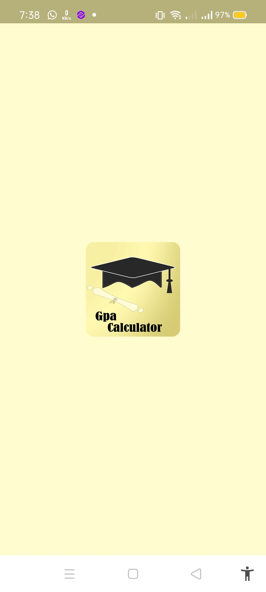
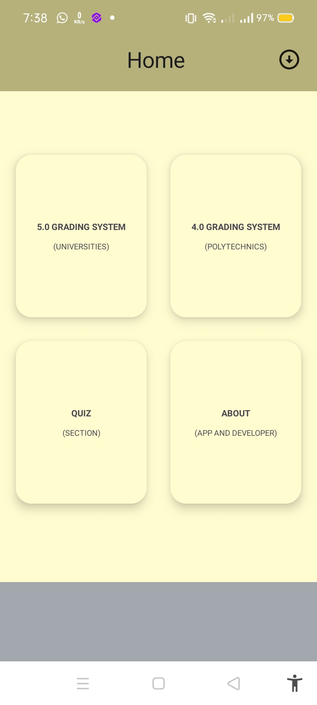
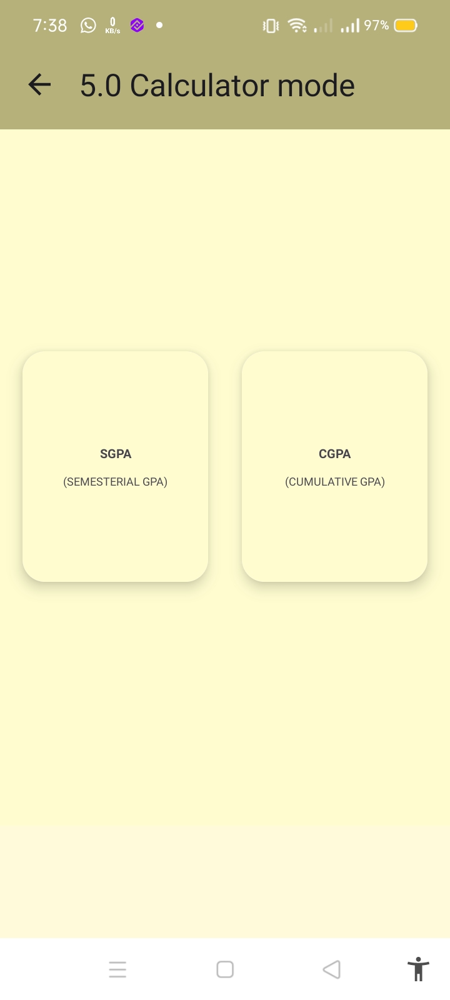
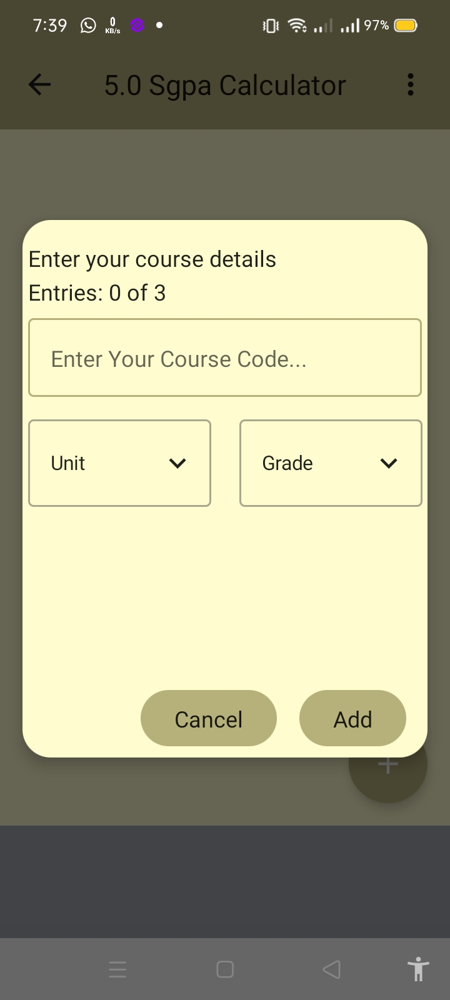
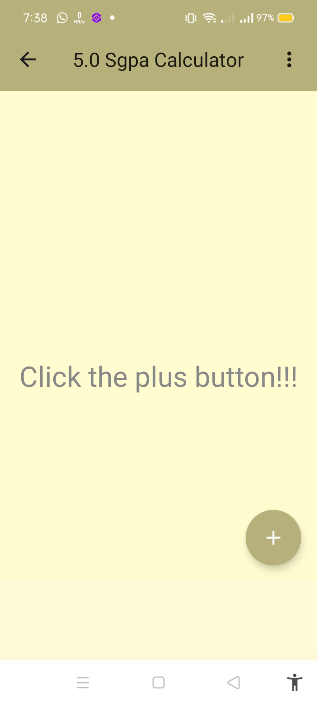
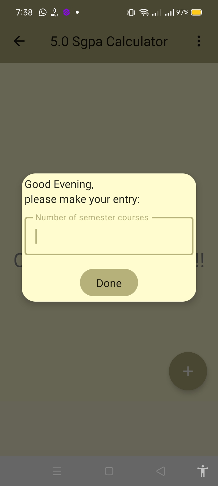
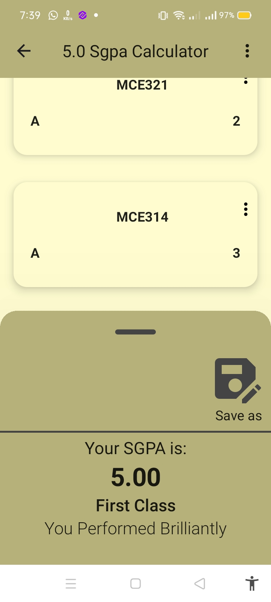
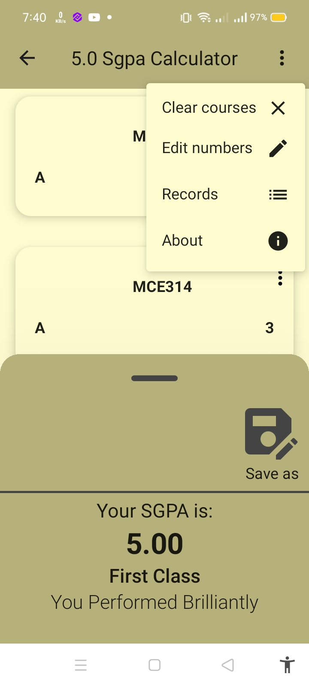
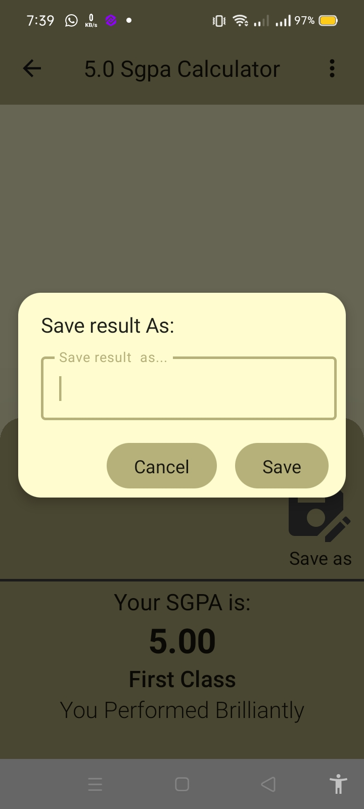
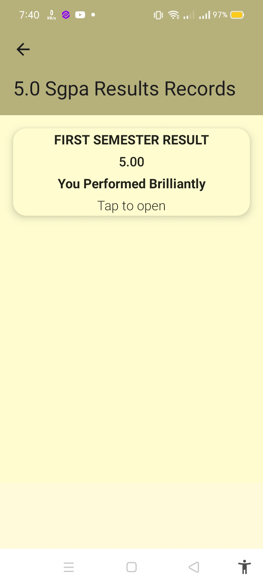

# **CGPA-SGPA Calculator/Quiz App**

A  user-friendly native Android app built with **Kotlin** and **Jetpack Compose** for calculating your CGPA, SGPA Result for both universities and polytechnics using  the 4.0 or 5.0 grading system, also has a quiz section for enhancing student understanding on a variety discipline.

## **Features**

- **Enter total number of courses**: Users can add to tal number of courses for thier semester.
- **Enter course details**: A dialog box for entering a course details.
- **Calculate Result based on**: Entered details.
- **Clean Architecture**: Organized in a clear structure using modern Android development practices.
- **Design Pattern**: Used the MVI design pattern.
- **Dependency Injection**: Used dependency injection using daggerhilt.
- **Room**: Used for persisently Storing calculated results.
- **API Request**: Used retrofit for making API Request to retrieve quiz questions.
- **Navigation**: Used Compose Navigation for navigation and passing data between result screen.

## **Installation Guide**

### **Prerequisites**

Before installing the app, ensure you have the following installed:

- **Android Studio** (version 5.0 or higher)
- **Kotlin** (latest stable version)
- **Android SDK** (latest stable version)

### **Steps to Install**

1. **Clone the Repository**  
   Clone the project from GitHub: https://github.com/abduleneye/CGPA-SGPA-QuizApp.git

3. **Open the Project in Android Studio**
Launch Android Studio
Select Open an existing project.
Navigate to the project directory and select the folder where the project is saved.

4. **Set Up Dependencies**

Android Studio should automatically prompt you to sync the project with Gradle. If not, click Sync Now in the toolbar to sync the dependencies.
Make sure all dependencies are properly installed by checking the Gradle Sync status.

4. **Build the Project**

Once the project syncs successfully, click on Build > Rebuild Project to make sure everything compiles correctly.

5. **Run the App**

Connect a physical device or start an emulator.
Click the Run button in Android Studio (the green triangle) to launch the app on your device or emulator.

6. **Permissions**

The app requires Internet permissions to connect to APIs. Ensure the necessary permissions are added in the AndroidManifest.xml.

**HTTP Endpoint**

The app uses Retrofit for network operations.

Base URL: https://opentdb.com/api.php?amount = 10

<table>
  <tr>
    <td align="center">
      
       Screenshot 1
    </td>
    <td align="center">
      
       Screenshot 2
    </td>
     <td align="center">
      
       Screenshot 3
    </td>
    <td align="center">
      
       Screenshot 4
    </td>
     <td align="center">
      
       Screenshot 5
    </td>
    <td align="center">
      
       Screenshot 6
    </td>
      </td>
     <td align="center">
      
       Screenshot 7
    </td>
    <td align="center">
      
       Screenshot 8
    </td>
    </td>
      </td>
     <td align="center">
      
       Screenshot 9
    </td>
    <td align="center">
      
       Screenshot 10
    </td>
  </tr>
</table>

